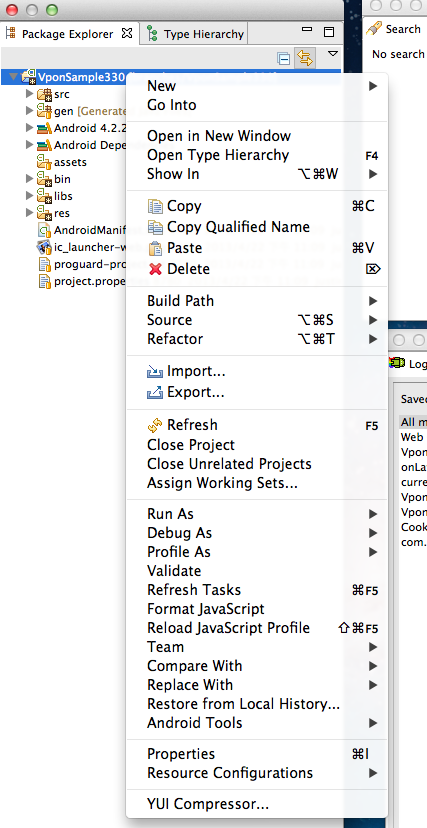

# VPON SDK 4 Fundamental
----
若您曾使用過舊版SDK，請先閱讀: [升級最新 SDK 所需修改](/zh-tw/update-to-SDK4_2_x/)

1. 請先從註冊網址檢查您的 Ad Network 平台:<br>
Taiwan 平台為 <http://tw.pub.vpon.com/><br>
China  平台為 <http://cn.pub.vpon.com/>

2. 如果您申請的是 Taiwan 的平台，請使用：
`vponBanner = new VpadnBanner(this, bannerId, VpadnAdSize.SMART_BANNER,
“TW”);`

3. 如果您申請的是 China 的平台，請使用： <br>
`vponBanner = new VpadnBanner(this, bannerId, VpadnAdSize.SMART_BANNER,
“CN”);`
<br>

# 概要
--------
VPON 橫幅廣告 (banner) 利用畫面的一小部分來吸引使用者點擊，即可打開全螢幕享受更豐富的瀏覽體驗，例如網站或應用程式商店網頁。
若要在 Android 應用程式中顯示橫幅廣告，只要在您的 Eclipse 專案中導入 SDK，然後在使用者介面上加入 com.vpadn.ads.VpadnBanner 即可。
# 系統需求
-----------
VPON 廣告 Android 版的 SDK 需至少搭配 Android 2.1.X 或更新版本使用。請確認您所使用的是最新版的 Android SDK，並依據 Android v4.X 或更新版本進行編譯 (將 default.properties 中的 target 設為 android-17)。

# 導入 SDK
----------
要在應用程式中加入 VPON 廣告，您必須完成三個步驟：

1. 在 Eclipse 專案中加入 VPON SDK 4 JAR
2. 在 AndroidManifest.xml 中宣告 com.vpadn.widget.VpadnActivity
3. 在資訊清單中設定必要的 permissions。


## 新增 SDK JAR
1. 在 Eclipse 中的應用程式專案上按一下滑鼠右鍵，並選擇 `Properties`。


2. 選取 `Java Build Path` (Java 建構路徑) 和 `Libraries` (程式庫) 分頁，然後按一下 `Add External JARs...`` (新增外部 JAR...)，加入 VPON 廣告 JAR。


## VpadnActivity
---
加入以下設定在您的 AndroidManifest.xml

``` java
      <activity
            android:name="com.vpadn.widget.VpadnActivity"
            android:configChanges="orientation|keyboardHidden|navigation|keyboard|screenLayout|uiMode|screenSize|smallestScreenSize"
            android:theme="@android:style/Theme.Translucent"
            android:hardwareAccelerated="true" >
      </activity>
```
> **注意**: 上面**每一個**屬性都不能少,其值都需要相同！

<br>

## Permissions
---
加入以下 permission 在您的 AndroidManifest.xml

```java
        <uses-permission android:name="android.permission.INTERNET" />
        <uses-permission android:name="android.permission.READ_PHONE_STATE"/>
        <uses-permission android:name="android.permission.ACCESS_COARSE_LOCATION"/>
        <uses-permission android:name="android.permission.WRITE_EXTERNAL_STORAGE" />
        <uses-permission android:name="android.permission.ACCESS_WIFI_STATE" />
        <uses-permission android:name="android.permission.ACCESS_NETWORK_STATE"/>
```
上面六個是必要的 permission，另外建議您可以開啟下面這個 permission，將可以更精準的定位取得地理位置相關的廣告


```java
      <uses-permission android:name="android.permission.ACCESS_FINE_LOCATION"/>
```
另外下面這個permission可以提高辨識使用者身分的能力，讓廣告能更精準的被投放，進而為您帶入更多的營收


```java
      <uses-permission android:name="android.permission.GET_ACCOUNTS"/>
```

由於Vpon SDK 4有大量的 Video 廣告，建議您在你放 Banner 的 Activity 內加入硬體加速，如下


```xml
<activity
       android:name="com.vpadn.example.MainActivity"
       android:label="@string/app_name"
       android:configChanges="keyboardHidden|orientation"
       android:hardwareAccelerated="true" >
       <intent-filter>
           <action android:name="android.intent.action.MAIN" />
           <category android:name="android.intent.category.LAUNCHER" />
       </intent-filter>
   </activity>
```


# 撰寫 Banner
---
Android 應用程式由 View 物件所組成，也就是以文字區域和按鈕等控制項的形式向使用者呈現的 Java 執行個體。VpadnBanner 只是另一種 View 子類別，用來顯示由使用者點擊觸發的小型 HTML5 廣告。
和所有的 View 一樣，AdView 可以單用程式碼撰寫，也可以絕大部分用 XML 寫成。
加入橫幅廣告會用到程式碼：

1. 匯入 com.vpadn.ads.*
2. 宣告 VpadnBanner 執行個體
3. 建立例項，指定BannerId，也就是Vpon申請的BannerId
4. 將該檢視加進使用者介面
5. 透過廣告載入例項

最簡易的方式是在應用程式的 Activity 內進行上述所有步驟。

```java
  import com.vpadn.ads.*
  public class MainActivity extends Activity {
  	private RelativeLayout adBannerLayout;
  	private VpadnBanner vponBanner = null;
  	//TODO: VPON Banner ID
  	private String bannerId = CHANGE ME ;

         @Override
  	protected void onCreate(Bundle savedInstanceState) {
  		super.onCreate(savedInstanceState);
  		setContentView(R.layout.activity_main);
  		//get your layout view for Vpon banner
  		adBannerLayout = (RelativeLayout) findViewById(R.id.adLayout);
  		//create VpadnBanner instance
                  vponBanner = new VpadnBanner(this, bannerId, VpadnAdSize.SMART_BANNER, "TW");
  		VpadnAdRequest adRequest = new VpadnAdRequest();
  		//set auto refresh to get banner
  		adRequest.setEnableAutoRefresh(true);
                  //load vpon banner
  		vponBanner.loadAd(adRequest);
                  //add vpon banner to your layout view
  		adBannerLayout.addView(vponBanner);
  	}

  	@Override
  	protected void onDestroy() {
  		super.onDestroy();
  		if (vponBanner != null) {
  			//remember to call destroy method
  			vponBanner.destroy();
  			vponBanner = null;
  		}
  	}
    }
```
  <br>

# 使用 layout xml 設定 banner
---
也可以直接使用xml 定義Banner 這樣你就不需要寫任何java code

``` xml
  <LinearLayout xmlns:android="http://schemas.android.com/apk/res/android"
      xmlns:vpadn="http://schemas.android.com/apk/lib/com.vpadn.ads"
      android:id="@+id/mainLayout"
      android:layout_width="fill_parent"
      android:layout_height="fill_parent"
      android:orientation="vertical" >

      <RelativeLayout
          android:id="@+id/adLayout"
          android:layout_width="fill_parent"
          android:layout_height="wrap_content" >

          <com.vpadn.ads.VpadnBanner
              android:id="@+id/vpadnBannerXML"
              android:layout_width="wrap_content"
              android:layout_height="wrap_content"
              vpadn:adSize="SMART_BANNER"
              vpadn:autoFresh="true"
              vpadn:bannerId= CHANGE_ME
              vpadn:loadAdOnCreate="true"
              vpadn:platform="TW" />
      </RelativeLayout>
  </LinearLayout>
```
<br>
記得將上面的 vpon:bannerId 填入你真實的 banner ID
如果你的 banner ID 還未經過審核可以使用下列的方式取得測試廣告
<br>

```java
      VpadnAdRequest adRequest =  new VpadnAdRequest();
      HashSet<String> testDeviceImeiSet = new HashSet<String>();
      testDeviceImeiSet.add("your device advertising id");
      //TODO: put Android device advertising id
      adRequest.setTestDevices(testDeviceImeiSet);
      vponBanner.loadAd(adRequest);
```
可以使用下列方式取得 device 上的 Advertising ID

1. 從 eclipse 上的 log 搜尋"advertising_id"
2. 直接操作手機: 設定 --> Google --> 廣告 --> 您的廣告 ID (Advertising ID)

# 其他訣竅
請參閱[中階使用](../advanced)中更多的橫幅廣告簡介。


# 下載 Sample code
---
[Go to download page](../../index.html#download)

# 結果
---
現在只要執行這個應用程式，您應該就會在畫面上方看到橫幅廣告：

